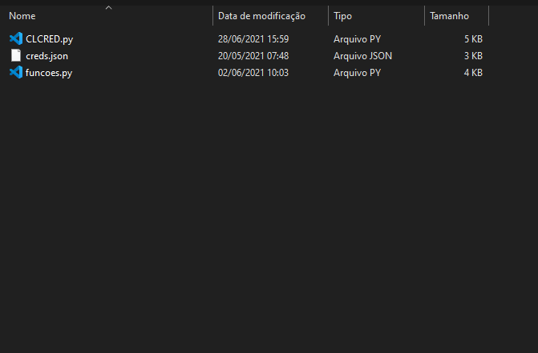
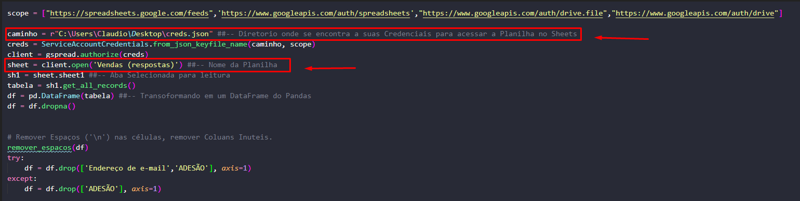
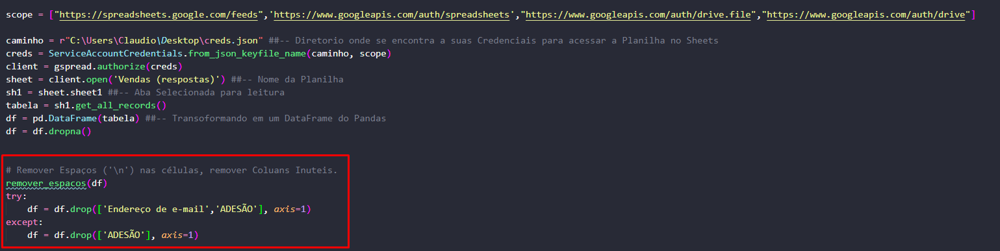

# Bem vindo ao repositório de Integração com a API do Google Sheets!
Automação que utiliza O **Google Sheets API** para Obter as informações de um planilha, a integração é feita através de um arquivo **Json** com as credenciais. Trata todos os dados e possíveis erros de digitação, já que planilha é de respostas de um formulário, e depois cria **Um Arquivo em Excel na Área de Trabalho.**

## Redes Sociais:
* [Site](https://portfolio-claudio.herokuapp.com)
* [Instagram](https://www.instagram.com/claudiogfez/)
* [Linkedin](https://www.linkedin.com/in/clcostaf/)

# Instalação

1. Primeiramente você pode clonar este repositório.

```
$ git clone https://github.com/clcosta/Google_Sheets_API.git
```

2. Agora a instalação das bibliotecas

```
pip install -r requirements.txt
```

# Como utilizar

1. Será necessário criar o seu próprio arquivo Json dentro da pasta onde o Script vai rodar.  
	**Recomendo Pesquisar sobre o Google Cloud API's**  

    

2. Se atente aos Paths de Arquivos e Nomes das planilhas.  
	__Cuidado caso tenha 2 planilhas com o mesmo nome tente renomear uma delas.__

    

3. Se atente ao nome de colunas, e as colunas que foram deletadas.  
	__Na sua planilha o nome das colunas serão diferentes porém a ideia é a mesma.__

	

4. Com tudo já instalado e modificado é só executar o código!
```
python main.py
```
---

## Referência
**Referência inicial: Youtuber Tech With Tim**

* [Vídeo do Tim](https://www.youtube.com/watch?v=cnPlKLEGR7E)


# Autor
| [<br><sub>@clcostaf</sub>](https://github.com/clcosta) |
| :---: |